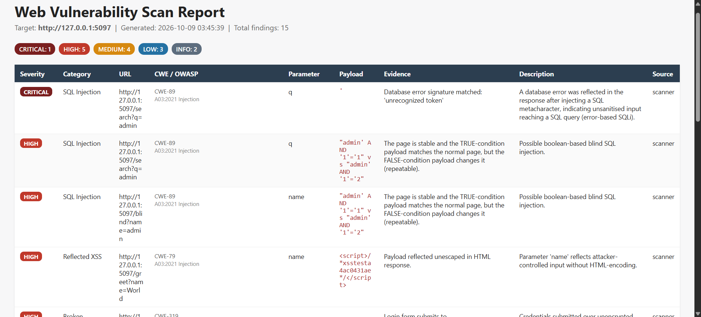
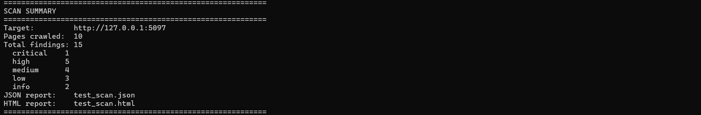

# Vulynx


[](https://github.com/KatameLynx/vulynx/actions/workflows/tests.yml)

Vulynx is a Python web application vulnerability scanner. It crawls a target site and tests it for **SQL injection**, **reflected XSS**, **open redirects**, **authentication/CSRF weaknesses**, and **missing security headers**, then writes a severity-ranked **JSON** and **HTML** report.

It is built on `requests` and `BeautifulSoup`, and is a learning project: the goal is clear, testable detection logic with a low false-positive rate, not to replace tools like OWASP ZAP or Burp Suite.

---

## Table of Contents

* [Demo](#demo)
* [Features](#features)
* [Legal & Ethical Use](#legal--ethical-use)
* [Installation](#installation)
* [Usage](#usage)
* [CLI Reference](#cli-reference)
* [Output Files](#output-files)
* [How False Positives Are Reduced](#how-false-positives-are-reduced)
* [Limitations](#limitations)
* [Architecture](#architecture)
* [Running Tests](#running-tests)
* [License](#license)

---

## Demo

Vulynx run against the deliberately vulnerable Flask app from `tests/` (a local target I own). Every finding carries its severity, the affected URL and parameter, the payload that triggered it, the evidence, and a CWE / OWASP Top 10 (2021) reference.

**HTML report**



**CLI summary**



---

## Features

### Crawling

* **Same-origin crawler** that discovers pages and HTML forms inside the target domain only.
* Respects `robots.txt` by default (override with `--ignore-robots`), with a page budget and a request delay.
* Redirect-aware: pages that redirect outside the target are not followed.

### Vulnerability Detection

|Category|Checks|
|-|-|
|**SQL Injection**|*Error-based*: SQL error signatures in the response (ignored if the page already contained that text). *Boolean-based blind*: compares a TRUE and a FALSE payload against the normal page. *Time-based blind*: opt-in, adds latency to the target.|
|**Reflected XSS**|Injects a unique per-run marker in common XSS vectors and confirms **unescaped** reflection; properly encoded output is not flagged.|
|**Open Redirect**|Tests redirect-style parameters (`next`, `url`, `return`, `redirect`, ...) with protocol-relative, backslash-bypass, and absolute-URL payloads; detects HTTP 3xx, `<meta refresh>`, and JavaScript redirects.|
|**Broken Authentication**|Session cookies missing `Secure`/`HttpOnly`; login forms submitted over plain HTTP; username enumeration (login answers differently for an unknown user than for an existing user with a wrong password).|
|**Missing CSRF Protection**|State-changing `POST` forms without a CSRF-token-like hidden field. Plain search forms are skipped.|
|**Missing Security Headers**|`Strict-Transport-Security`, `Content-Security-Policy`, `X-Frame-Options`, `X-Content-Type-Options`, `Referrer-Policy`, `Permissions-Policy`; also flags version disclosure in the `Server` header.|

### Reporting & Safety

* **JSON and HTML reports**, ranked by severity. All target-controlled text is HTML-escaped in the report.
* **Standard references**: every finding is tagged with a CWE id and an OWASP Top 10 (2021) category (for example SQL injection is `CWE-89` / `A03:2021 Injection`).
* **Authorization gate**: the tool requires you to confirm you are authorized to scan the target before it sends a single test payload.
* Rate limiting via `--delay`, and the most intrusive checks (time-based SQLi) are off by default.

---

## Legal & Ethical Use

Vulynx actively sends attack-pattern payloads (SQLi / XSS / open redirect test strings) to the target, submits its forms, and may send a few failed login attempts.

> **Only scan applications you own or have explicit written authorization to test.**

Unauthorized scanning may violate computer misuse laws in your jurisdiction and can trigger WAF blocks, alerts, or logging on systems you do not control. It is intended for authorized penetration testing, bug bounty programs (within their scope rules), and security education on your own test environments.

---

## Installation

Requires Python 3.9+.

```bash
git clone https://github.com/KatameLynx/vulynx.git
cd vulynx
pip install -r requirements.txt
```

---

## Usage

**Basic scan** (interactive authorization prompt):

```bash
python3 vulynx.py -u https://your-test-site.com
```

**Skip the interactive prompt** (you must still be authorized):

```bash
python3 vulynx.py -u https://your-test-site.com --confirm
```

**Larger crawl at a gentler rate, custom report name:**

```bash
python3 vulynx.py -u https://your-test-site.com --confirm \
    -o my_scan --max-pages 100 --delay 1.0
```

**Authenticated scan** (pass a session cookie so the crawler can reach logged-in pages):

```bash
python3 vulynx.py -u https://your-test-site.com --confirm \
    --cookie "session=abc123"
```

**Username-enumeration check with a known account** (one failed login is sent per name; default is `admin`):

```bash
python3 vulynx.py -u https://your-test-site.com --confirm --known-user alice
```

**Enable time-based blind SQLi tests** (more intrusive, adds real latency):

```bash
python3 vulynx.py -u https://your-test-site.com --confirm --enable-time-based
```

---

## CLI Reference

|Option|Description|
|-|-|
|`-u`, `--url`|Target base URL **(required)**|
|`-o`, `--outfile`|Output base filename (default: `scan_<timestamp>`)|
|`--confirm`|Skip the interactive authorization prompt|
|`--max-pages`|Max pages to crawl (default: `50`)|
|`--delay`|Delay between requests in seconds (default: `0.4`)|
|`--timeout`|Per-request timeout in seconds (default: `10`)|
|`--ignore-robots`|Don't respect `robots.txt` while crawling|
|`--enable-time-based`|Enable time-based blind SQLi tests (off by default)|
|`--cookie NAME=VALUE`|Send an authenticated session cookie (repeatable)|
|`--header "Name: value"`|Extra request header (repeatable)|
|`--known-user NAME`|Existing username for the enumeration check (repeatable, default: `admin`)|
|`-v`, `--verbose`|Verbose logging|

---

## Output Files

|File|Contents|
|-|-|
|`<base>.json`|Machine-readable findings, ranked by severity, including `cwe` and `owasp` fields|
|`<base>.html`|Human-readable report with a findings table|

---

## How False Positives Are Reduced

Scanners that guess are noisy, so each check has a guard:

* **Boolean-based SQLi** uses a baseline. The page must be stable (two plain requests match), the TRUE payload must look like the normal page, the FALSE payload must change it, and the FALSE result must repeat. Dynamic pages (random content, timestamps in text) are skipped instead of reported.
* **Error-based SQLi** ignores a SQL error string that was already on the page before any payload was sent (for example a tutorial page).
* **Username enumeration** first checks that two *unknown* users get identical answers; only then does it compare against a likely-existing user. Rate-limit (`429`) and server-error responses are ignored.
* **XSS** requires the payload to be reflected *unescaped*; HTML-encoded output is not reported.
* **CSRF** is only checked on state-changing `POST` forms, not on search boxes or `GET` forms.
* Page comparison ignores markup, scripts, and whitespace (see `scanner/textdiff.py`).

---

## Limitations

Vulynx is a heuristic scanner and a learning project. Know what it does not do:

* **XSS is reflected-only and not context-aware.** Stored and DOM-based XSS are not tested.
* **Boolean SQLi needs an existing value.** If the original parameter value returns an empty result, TRUE and FALSE payloads look identical and nothing is reported (error-based detection may still catch it).
* **No JavaScript rendering.** Single-page apps whose links and forms are built by JavaScript are not crawled.
* **CSRF check is token-field based.** Protection delivered through headers, cookies, or `SameSite` alone is not detected.
* **Enumeration check is a heuristic** and depends on a username that really exists (`--known-user`).
* Findings are *indicators* that need manual confirmation, not proof of exploitability.

---

## Architecture

```text
scanner/
├── crawler.py         Same-origin crawler (requests + BeautifulSoup, robots.txt aware)
├── forms.py           HTML form parsing/submission helpers
├── payloads.py        SQLi / XSS / open redirect payloads and signatures
├── textdiff.py        Response comparison helpers (visible text, similarity)
├── findings.py        Shared Finding data model + de-duplicating collector
├── sqli.py            SQL injection scanner (error / boolean / time-based)
├── xss.py             Reflected XSS scanner
├── open_redirect.py   Open redirect scanner
├── auth.py            Authentication, CSRF and cookie checks
├── headers.py         Security headers checker
└── report.py          JSON + HTML report generation

vulynx.py              CLI entrypoint: authorization gate, crawl, scan, report

docs/                  Screenshots used in this README
.github/workflows/     CI: runs the test suite on Python 3.9 - 3.12

tests/
├── conftest.py                  sys.path setup + live test-server fixture
├── vulnerable_test_app.py       Deliberately vulnerable Flask app used as the target
├── test_scanners.py             SQLi / XSS / auth detection tests
├── test_detection_accuracy.py   False-positive guards (dynamic pages, CSRF, enumeration, ...)
├── test_open_redirect.py        Open redirect detection tests
├── test_headers.py              Security headers tests
└── test_crawler.py              Crawler behaviour + full crawl -> scan -> report test
```

---

## Running Tests

The suite starts a small, deliberately vulnerable Flask app in-process and scans it, so no external network access is needed. CI runs it on Python 3.9 to 3.12.

```bash
pip install -r requirements-dev.txt
pytest tests/ -v
```

It checks both directions: vulnerable endpoints **are** flagged, and safe or noisy ones **are not**.

* **SQLi**: error-based and boolean-blind detection; parameterized queries, dynamic pages, and pages that merely mention SQL errors are not flagged
* **XSS**: unescaped reflection is flagged; escaped reflection is not
* **Auth / CSRF**: missing CSRF token, username enumeration, cookie without `HttpOnly`; generic login errors, token-protected forms, search forms and `GET` forms are not flagged
* **Open Redirect**: vulnerable `next=` is flagged; a validated redirect and an unused parameter are not
* **Headers**: missing headers are reported once per host; present headers are not reported; matching is case-insensitive
* **Crawler**: discovers linked pages and forms, stays in scope, honors `max_pages` and `robots.txt`
* **End to end**: a full run through the CLI produces the expected JSON/HTML findings

---

## License

MIT. See [LICENSE](LICENSE).

